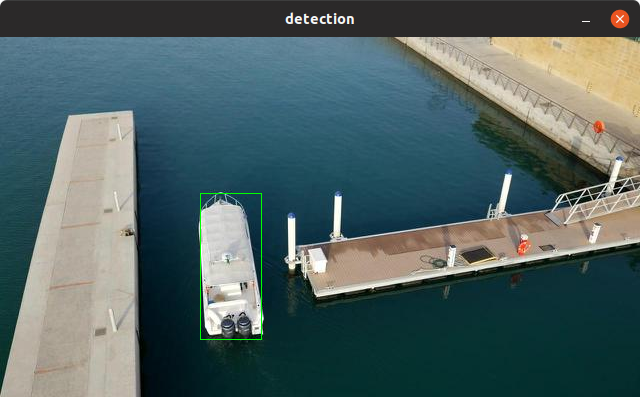

# Getting Started

## Installation

### Requirements

The following steps have been tested for Ubuntu 16.04 but should work with
other distros as well. 

Most required packages can be installed using the following commands
(`sudo` permission may be required):

    apt-get install build-essential perl git pkg-config check
    cpan install JSON Sort::strverscmp

This project also depends on [TensorLight](https://github.com/zhaozhixu/TensorLight),
a lightweight tensor operation library. Install it according to 
[its repository](https://github.com/zhaozhixu/TensorLight) before continuing to
build LightNet.

* (Optional) Packages for building documents

    Use the following commands to install the packages for building documents:
    
        apt-get install python3-pip
        pip3 install mkdocs markdown==3.1.1

* (Optional) Packages for building python packages

    Use the following commands to install the packages for building python packages 
    (python3 for example):
    
        apt-get install python3-setuptools

* (Optional) CUDA dependency

    You also have to install CUDA 8.0 (or later) according to its website
    [CUDA Toolkit](http://docs.nvidia.com/cuda/cuda-installation-guide-linux/index.html)
    if you want to build with CUDA support.
    Remember to put `nvcc` (usually in `/usr/local/cuda/bin`) in environment
    variable `PATH`.

* (Optional) cuDNN dependency

    You also have to install CUDA 8.0 (or later) and cuDNN 7.0 (or later)
    libraries, according to their websites
    [CUDA Toolkit](http://docs.nvidia.com/cuda/cuda-installation-guide-linux/index.html) and 
    [cuDNN](https://docs.nvidia.com/deeplearning/sdk/cudnn-install/index.html) 
    if you want to build with cuDNN support.

* (Optional) TensorRT dependency

    You also have to install CUDA 8.0 (or later) and TensorRT 3.0 (or later) 
    libraries, according to their websites
    [CUDA Toolkit](http://docs.nvidia.com/cuda/cuda-installation-guide-linux/index.html) and 
    [TensorRT](https://docs.nvidia.com/deeplearning/sdk/tensorrt-install-guide/index.html)
    if you want to build with TensorRT support.

### Building and Installation

1. Clone this repository to your local directory.

        cd <my_working_directory>
        git clone https://github.com/zhaozhixu/LightNet.git
        cd LightNet

2. Configure and build

    First, configure your installation using:
    
        chmod +x configure
        ./configure
    
    There are options to custom your building and installation process.
    You can append them after `./configure`. For example, use
    
        ./configure --install-dir=DIR
        
    to set the installation directory (default is `/usr/local`). Use
    
        ./configure --with-cuda=yes
        
    if you want to build with CUDA support.
    
    Detailed `./configure` options can be displayed using `./configure -h`.

    After that, use `make` to compile the binaries, and run the test.
    Finally, use `make install` to install the build directory into
    the installation directory.

3. Other `make` options

    Use `make info` to see other `make` options.
    Especially, you can use `make clean` to clean up the build directory and all
    object files, and `make uninstall` to remove installed files from
    the installation directory.

## Usage

After compilation, the following components will be installed:

- lightnet: LightNet command tool
- liblightnet.so: LightNet runtime library
- ir2json.pl: LightNet intermediate language (IL) interpreter
- pylightnet (optional): LightNet python wrapper package

LightNet provides 3 interfaces which can be used by developers and users:

- [Command line](Getting-Started.md#Command-line)
- [C API](Getting-Started.md#C-API)
- [Python API](Getting-Started.md#Python-API)

### Command line

From the command line, type `lightnet -h` can display the program usage, as 
follows.

```
Usage: lightnet [OPTION...] SOURCE
Apply compilation procedures to SOURCE according to the options.
If SOURCE is -, read standard input.

Options:
  -h, --help             display this message
  -v, --version          display version information
  -o, --outfile=FILE     specify output file name; if FILE is -, print to
                         standard output; if FILE is !, do not print;
                         (default: out.json)
  -t, --target=TARGET    specify target platform (default: cpu)
  -f, --datafile=FILE    specify tensor data file
  -c, --compile          compile only; do not run
  -r, --run              run only; do not compile; SOURCE should have been
                         memory-planned
  -Wwarn                 display warnings (default)
  -w, -Wno-warn          do not display warnings
  -Winter                display internal warnings (default)
  -Wno-inter             do not display internal warnings
  -debug                 display debug messages (only works with LN_DEBUG
                         defined when compiling)
```

### C API

### Python API

An example using the python api is in `example/detect.py` and demoed with
`example/object-detect.py`.
This example performs an object detection algorithm using 
[TensorRT](https://docs.nvidia.com/deeplearning/sdk/tensorrt-install-guide/index.html),
with [ShuffleNetV2](https://arxiv.org/abs/1807.11164) as back-bone conv-net
and [SqueezeDet](https://arxiv.org/abs/1612.01051)'s detection part as feature
expression algorithm. 

To play with this demo, LightNet should be configured with

    --with-tensorrt=yes --with-python=yes

After compilation and installation, enter the following
command in the repository and you should get a dection window with bouding 
boxes detecting the images in `example/data/images` dynamicly.

    example/object-detect.py -d example/data/images


